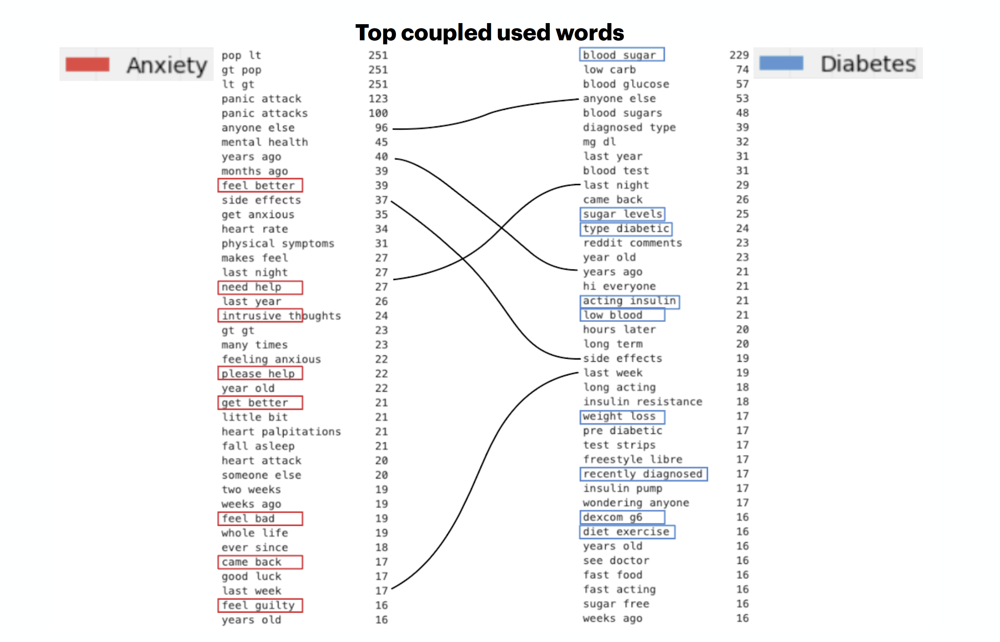

#  Project 3: Web APIs and Natural Language Processing

### Overview

This first NLP experience covers:

~~~~~~~
- Reddit Submission and Comments webscrapping
- Text cleaning, comments and submissions
    -- Tokenizing and Lemmatizing
- Basic statistics, distibutions, word counts, character count
- EDA and visualizations to understand our data
    -- Overall Sentiment analysis
    -- Closely looked sentiment texts
- Looking closely at overlaps
- Predictions and Modeling
    - KNeighbors
    - Random Forest
    - Multinomial Naive Bayes
- Conclusions
- Next Steps
~~~~~~~

This path to analyzing Anxiety and Diabetes subreddit text came initially looking at own family, and seeing how these auto-immune diseases are connected to our genetics and developed over time.
We often think of human interactions, and after Covid-19 it’s become evident of how Reddit can become community support group, specially for these 2 specific subreddits. Where you can get support, help, advices, helpful tips and tools, it's a support system.

### Problem Statement
According to the Journal of Psychosomatic Research, a review of the association of diabetes with anxiety, a systematic review and meta-analysis in which supports that diabetes is associated with an increased likelihood of having anxiety disorders and elevated anxiety symptoms.([*source*](https://id.elsevier.com/as/authorization.oauth2?platSite=SD%2Fscience&scope=openid%20email%20profile%20els_auth_info%20els_idp_info%20els_sa_discover%20urn%3Acom%3Aelsevier%3Aidp%3Apolicy%3Aproduct%3Ainst_assoc&response_type=code&redirect_uri=https%3A%2F%2Fwww.sciencedirect.com%2Fuser%2Fidentity%2Flanding&authType=SINGLE_SIGN_IN&prompt=login&client_id=SDFE-v3&state=retryCounter%3D0%26csrfToken%3D52524209-7af1-45ef-94f8-1779a6602bfe%26idpPolicy%3Durn%253Acom%253Aelsevier%253Aidp%253Apolicy%253Aproduct%253Ainst_assoc%26returnUrl%3D%252Fscience%252Farticle%252Fpii%252FS0022399912003339%26prompt%3Dlogin%26cid%3Darp-5962dffb-7b64-4750-9be2-dd7b15aa834f))

**My problem statement** answers a question of, is this correlation also reflected on subreddits comments and submissions?

---

Let's take a look:

> 1. **Comparing word Count** distributions of anxiety and diabetes throughout subreddits since November 2020.
Evidence shows little significance in word count and characters. However anxiety subreddit has a higher average of 101 words and diabetes with an average of 76 words.

> 2. Looking at **top words used** in each subreddit:
Words like feel, help, panic, anxious, bad, never, were cast as prevalent and important. Such as ‘panic attack’, ‘side effects’, ‘feel guilty’, ‘whole life’, ‘heart palpitations’, ’heart rate’, ‘intrusive thoughts’ for coupled Anxiety words are concerning.
Diabetes has a confident feel towards language, where solution words are most often used. As, ‘insulin’, ‘type’, ‘doctor’, feel used on a lower basis, ‘work’, ‘carbs’, ‘glucose’, ‘diet exercise’, ‘diagnosed’, ‘sugar levels’, ‘acting insulin’, ‘side effects’ are all words indicative of different maturity towards their conditions, greater understanding of their symptoms, share of more positive words in terms of outcomes and coping. Where subreddit is used more to share their experiences, than crying for help.

> 3. **Looking at overlaps:**
Overlapping coupled words such as ‘anyone else’, ‘need help’, ‘side effects’. 
Overlapping coupled time related words: ‘last night’, ‘years ago’ are significant to understand how it’s a daily struggle with their conditions and long lasting.
On anxiety point of view they are more confused, looking for help and assistance. Feel, get, larger amounts of word count, used for expressing their feelings.

> 4. They are in **different time stages:**
One has already initialized their process of recovery in a way. Was already pre-diagnosed, clear understanding of their conditions, already initialized their process of recovery in a way.  On anxiety point of view they are more confused, looking for help and assistance.
Anxiety top time words are :
9th: years ago
10th: month ago
Diabetes top time words are :
7th: last year
9th: last night
15th: years ago
19th: hours later
Also indicative of maturity towards their conditions, reporting of the facts as a coping mechanism.

> 5. Having a detailed understanding of the **sentiment of each texts**, diabetes has a positive connotation on their posts while anxiety has a more negatively charged posts as well as positives too. In the search for trends, which the beginning of October and November 2020 where covid-19 lock downs were more severe. You can visually spot more negatively charged than after January 2021 negatively charged posts are more spread out.

### Predictions Scores

MultinomialNB with TfidfVectorizer: 
{'tvec__max_features': 5000, 
 'tvec__ngram_range': (1, 1), 
 'tvec__stop_words': 'english'} 

Test score: 0.892

MultinomialNB with CountVectorizer: 
{'cvec__max_df': 0.9, 
 'cvec__max_features': 5000, 
 'cvec__min_df': 3, 
 'cvec__ngram_range': (1, 1)} 

Test score: 0.896

Random Forest: with 500 posts 
{'rf__max_depth': None, 
 'rf__max_features': 'sqrt', 
 'rf__n_estimators': 100, 
 'tvec__max_features': 2000, 
 'tvec__ngram_range': (1, 2), 
 'tvec__stop_words': 'english'} 

Test score: 0.835

### Conclusions
Yes, subreddit posts reflect how diabetes is associated with an increased likelihood of having anxiety disorders and elevated anxiety symptoms, as proved by Psychosomatic Research Paper.The 40% of patients with diabetes have heightened anxiety symptoms reported from The Journal of Psychosomatic Research, is visible throughout our text analysis, existence of coupled words overlap are both evidence of correlation mentioned in the Journal of Psychosomatic Research, which there is an overlap of words, but influences little on classification predictions. 
The overlap was analysed in atempt to visualize the possible anxiety and diabetes overlap. 

Our predictions are at range of 89% testing scores, which considering the correlations and causalities it’s an overall ‘good enough’ prediction score. Predictions misclassification can actually predict anxiety presence within diabetes and diabetes within anxiety posts, the overlap can be quantified the misclassification score.

### Next Steps suggestions

**The call-to-action** 
**Promoting mental health:** Offering a variety of services and programs, moderated online discussion forum. Possibly an official support group for anxiety, such as which medications might be helpful and how to dial with specific symptoms.  
**Screening tools:** Offer screening tools that can help you identify if you might have a mental illness, such as anxiety or PTSD. Giving a few extra questions to answer about your symptoms. Having actionable advice to talk to your physician or a mental health professional. 

# DiabetesAnxiety
